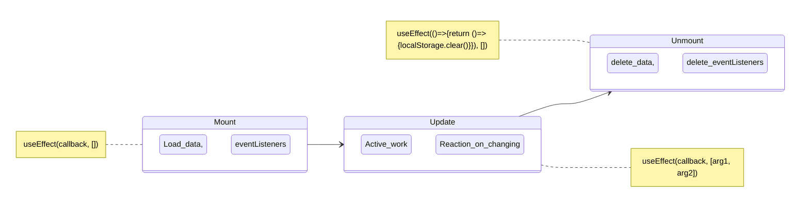

```mermaid
stateDiagram-v2
direction LR
Mount --> Update
Update --> Unmount
    state Mount {
        Load_data, eventListeners
    }
    state Update {
        Active_work
        Reaction_on_changing
    }
    state Unmount {
        delete_data,
        delete_eventListeners
    }
    note left of Mount : useEffect(callback, [])

    note right of Update : useEffect(callback, [arg1, arg2])
    note left of Unmount : useEffect(()=>{return ()=> {localStorage.clear()}}), [])
```
